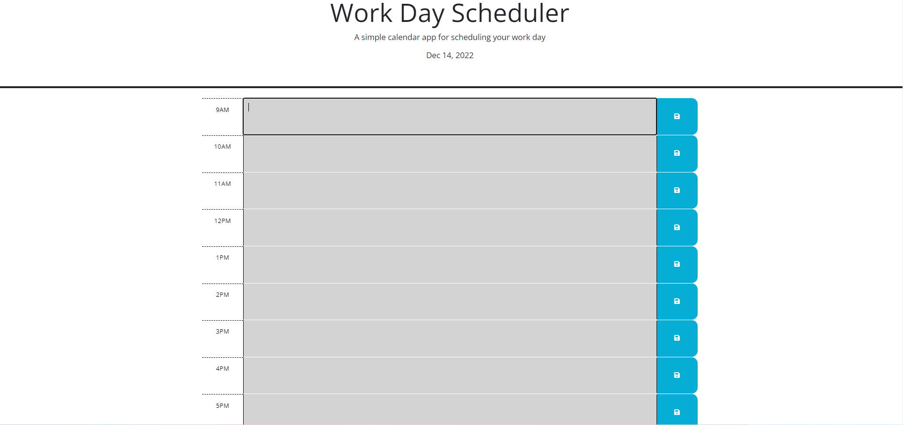

# Calendar app

## Description

For this week's project, the developer is given a starter code to construct a Calendar app. This application runs in the browser and displays usual business hour of a day. Each hour on the calendar is colour coded to reflect if the time block is in the past, present or future. The text area of each time block allows user to enter their input. This can then be saved into the local storage and reloaded onto the page after refreshing the browser.

You can access the application at https://sandy5433.github.io/Calendar-app/

## Usage

Below is a screenshot of the deployed webpage

The current date is displayed at the top of the time block. The time blocks are colour coded where gray represents past, red for present, and green for future time. Enter any notes in the text area of the calendar and click the save icon on the left hand side. You will be able to retrieve the entered value after refreshing or closing and reopening the browser.  

## Support

Please reach out to Sandy Hung at sandyhung83@yahoo.com.tw if you have any questions or comments regarding this project. Alternatively, head on to my GitHub at https://github.com/Sandy5433 to see more exciting projects.

## Roadmap

New coding projects will be released every Wednesday night. My first project, refactoring html/css code, can be found on my GitHub.

## Contributing

If you would like to contribute to the development of this timed quiz application, you can reach out to me via the contact details on my portfolio webpage. 

## Authors and acknowledgment

Many thanks to my instructors and tutors from USYD coding bootcamp who stayed back after class to support me on my journey in coding.

## Project status

Completed 14/12/2022
